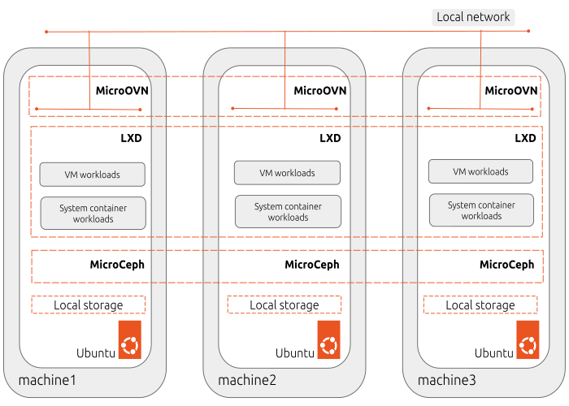

<p align="left">
    
    
</p>

# **MicroCloud**

Deploy a scalable, low-touch cloud platform in minutes with **MicroCloud**.

MicroCloud creates a lightweight cluster of machines that operates as an open source private cloud. It combines LXD for virtualization, MicroCeph for distributed storage, and MicroOVN for networking—all automatically configured by the [MicroCloud snap](https://snapcraft.io/microcloud) for reproducible, reliable deployments.

With MicroCloud, you can eliminate the complexity of manual setup and quickly benefit from high availability, automatic security updates, and the advanced features of its components such as self-healing clusters and fine-grained access control. Cluster members can run full virtual machines or lightweight system containers with bare-metal performance.

MicroCloud is designed for small-scale private clouds and hybrid cloud extensions. Its efficiency and simplicity also make it an excellent choice for edge computing, test labs, and other resource-constrained use cases.

<div style="display: flex; justify-content: center;">
  
</div>

## **Requirements**

MicroCloud can be deployed on machines running Ubuntu 22.04 or newer. A MicroCloud cluster can consist of a single cluster member for a testing deployment, and requires a minimum of 3 cluster members for a production deployment.

See: [Pre-deployment requirements](https://documentation.ubuntu.com/microcloud/latest/microcloud/how-to/install/#pre-deployment-requirements) in the MicroCloud documentation for a full list of requirements.


## **How to get started**

To get started, install the LXD, MicroCeph, MicroOVN, and MicroCloud snaps. You can install them all at once with the following command:

```sh
snap install lxd microceph microovn microcloud
```

Then start the bootstrapping process with the following command:

```sh
microcloud init
```

If you want to set up a multi-machine MicroCloud, run the following command on all the other machines:

```sh
microcloud join
```

Following the CLI prompts, a working MicroCloud will be ready within minutes.

The MicroCloud snap drives three other snaps ([LXD](https://documentation.ubuntu.com/microcloud/latest/lxd/), [MicroCeph](https://documentation.ubuntu.com/microcloud/latest/microceph/), and [MicroOVN](https://documentation.ubuntu.com/microcloud/latest/microovn/)), enabling automated deployment of a highly available LXD cluster for compute, with Ceph as the storage driver and OVN as the managed network.

During initialization, MicroCloud scrapes the other servers for details and then prompts you to add disks to Ceph and configure the networking setup.

At the end of this, you’ll have an OVN cluster, a Ceph cluster, and a LXD cluster. LXD itself will have been configured with both networking and storage suitable for use in a cluster.

For more information, see the MicroCloud documentation for [installation](https://documentation.ubuntu.com/microcloud/latest/microcloud/how-to/install/) and [initialization](https://documentation.ubuntu.com/microcloud/latest/microcloud/how-to/initialize/). You can also [follow a tutorial](https://documentation.ubuntu.com/microcloud/latest/microcloud/tutorial/get_started/) that demonstrates the basics of MicroCloud.

## **What about networking?**

By default, MicroCloud uses MicroOVN for networking, which is a minimal wrapper around OVN (Open Virtual Network).
If you decide to not use MicroOVN, MicroCloud falls back on the Ubuntu fan for basic networking.

You can optionally add the following dedicated networks:
  - a network for Ceph management traffic (also called public traffic)
  - a network for internal traffic (also called cluster traffic)
  - a network for OVN underlay traffic

### **RESOURCES:**

- Documentation: https://documentation.ubuntu.com/microcloud/latest/microcloud/
- Find the package at the Snap Store:

 [](https://snapcraft.io/microcloud)

- Snap package sources: [microcloud-pkg-snap](https://github.com/canonical/microcloud-pkg-snap)
